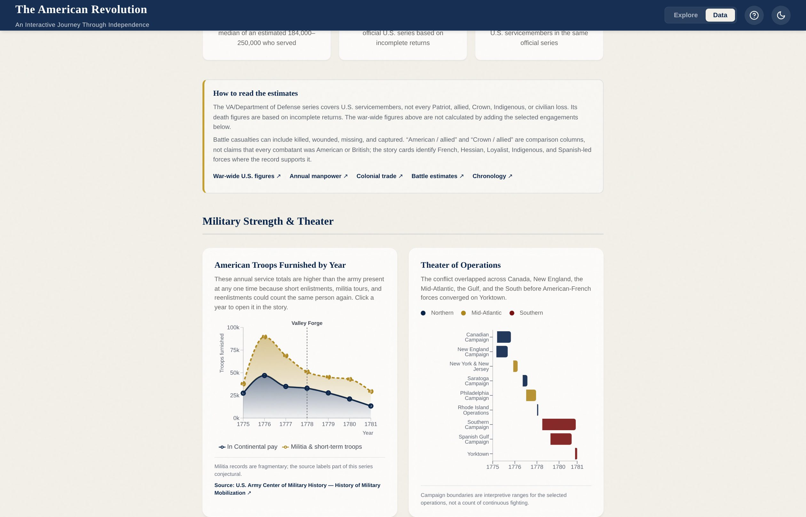
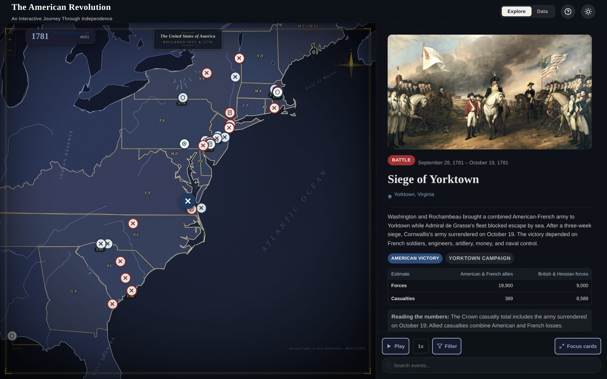
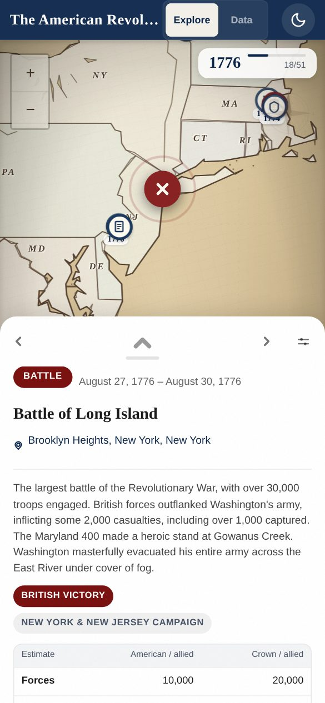

# The American Revolution — an interactive history

A map-led walk through the American Revolution, from the Stamp Act Congress in
1765 to the Treaty of Paris in 1783. Forty-seven events, each one pinned to
where it happened and linked to the source it came from, plus a data view for
the numbers behind them.

**[Open it →](https://am-re-viz.vercel.app)**


---

## What it does

**The story runs along the map, not under it.** Each step moves the chart to the
place the event happened and the card beside it carries the account, the
estimates, and a link to the source. Move with `←` `→`, the scroll wheel, the
Prev/Next buttons, or press Play and let it run.

**The map is drawn, not tiled.** There is no basemap service behind it. The
parchment is CSS and the coastlines, lakes and rivers are Natural Earth
geometry rendered as an 18th-century engraved chart, with the thirteen colonies
outlined over it. When the story crosses the Atlantic — Franklin at Passy, the
Commons vote, the treaty itself — the frame widens to put both shores on screen
at once.

**The numbers are separated from the narrative.** The data view carries
troop strength, colonial trade, casualties by engagement, and a battle
comparison, each captioned with what the figures do and do not cover.

| | |
|---|---|
|  |  |

On a phone the map and the narrative share the screen rather than taking turns:
a bottom sheet sits at just over half the viewport, with the map above it and
the opening paragraph above the fold. Swipe sideways to move through the story,
drag the sheet up to read the rest.



## The sourcing

Every one of the 47 events links to a public source — the National Park
Service, the American Battlefield Trust, the National Archives, the Office of
the Historian, and the Senate Historical Office. The aggregate figures come from
the Department of Veterans Affairs, the Army Center of Military History, and the
Census Bureau's historical statistics.

The estimates are handled carefully, and the reasoning is worth reading before
quoting a number: war-wide totals are **not** the sum of the engagements listed,
casualty counts mix killed, wounded, missing and captured, and the two
comparison columns are labelled "American / allied" and "Crown / allied"
because neither side was one nationality.

**[docs/DATA.md](docs/DATA.md)** sets out where each figure comes from and what
it does and does not cover.

## Accessibility

The app targets WCAG 2.2 AA and is tested against it rather than assumed to
meet it: axe runs over every view in both themes at both widths, and a sweep
measures the contrast of every rendered text node, since axe skips anything
over a gradient or drawn by the charting library — which is exactly where the
failures were.

It is fully keyboard operable, honours `prefers-reduced-motion` down to the
map's flights between events, announces each step to screen readers, gives
every chart a data table, and carries no meaning in colour alone: event types
have distinct symbols, chart series have stroke patterns, and a marker's
accessible name says which side held the place.

**[docs/ACCESSIBILITY.md](docs/ACCESSIBILITY.md)** records what is committed
to, how it is verified, and what is still open.

## Running it

```bash
cd client
npm install
npm run dev        # http://localhost:5173
```

```bash
npm run lint       # eslint, must be clean
npm run build      # must be clean
npm test           # 164 tests; boots its own server on 5174
npm run walkthrough   # the end-to-end walk through the whole app
```

The suite starts its own dev server on port 5174, so `npm run dev` can keep
running on 5173 alongside it. Set `AMREVIZ_TEST_URL` to point it at a server
you are already running instead.

`npm run walkthrough` is the repeatable pass over the whole thing: in from the
welcome screen, through all 47 events and 4 interludes in order, every control
in the explore view, every chart and its table in the data view, deep links and
Back/Forward, then the same story on a phone — failing on any uncaught
exception or console error it meets. `npm run walkthrough:shots` leaves a
screenshot of each stop in `client/test-results/walkthrough/`.

Map geometry under `client/src/data/geo/` is generated, not hand-edited:

```bash
cd client && node scripts/build-geo-data.mjs   # rewrites baseMap.js + colonyShapes.js
```

## How it is built

React 19 and Vite 7, with Leaflet for the map, Recharts for the charts, and
Framer Motion for transitions. No backend — the events and metrics are static
modules, and the whole thing deploys as a static site.

```
client/
  src/components/   Explore view, map, cards, charts, mobile sheet
  src/constants/    palette.js — every colour, with its measured contrast
  src/data/         events, interludes, metrics, generated geometry
  src/hooks/        hash routing, reduced motion, event images
  tests/            Playwright: UX, accessibility, colour
  scripts/          regenerate map geometry and event images
```

Two files are worth knowing about before changing anything visual.
`src/constants/palette.js` is the single source of truth for colour, and each
entry records the contrast ratio it was chosen for. `ROADMAP.md` is a running
account of what has been measured, what was tried and reverted, and why — read
it before re-litigating a decision.

## Reuse

The source material is drawn from US federal government publications and
public-history organisations; follow the link on each event or chart for the
provenance of a specific figure. Event images come from Wikipedia and each
carries its own credit link. No licence has been chosen for the code in this
repository yet, so treat it as all rights reserved until one is added.
